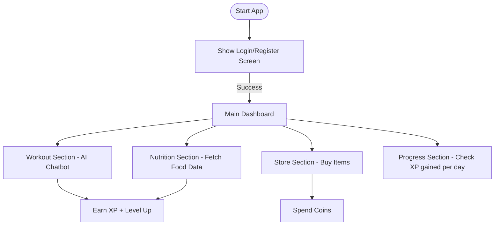

# Quad-Bytes

**`PROBLEM STATEMENT : Nutrition and Performance Planner`**

*`DESCRIPTION : Design an app that combines personalized workout routines with nutrition planning to optimize athletic performance based on individual health data`*
# 🏆 FIT-Quest - Innovation in Nutrition

Welcome to **FIT-Quest**, an innovative hackathon project that gamifies fitness and nutrition tracking!  
The project combines **Java**, **Swing UI**, **AI chatbots**, and a **website** for a full-stack experience.

---

## 🚀 Project Overview

FIT-Quest is a fitness and nutrition companion where users can:
- 🏋️ **Get personalized workout tips** using an AI chatbot.
- 🥗 **Fetch nutritional information** of any food item instantly.
- 🛍️ **Buy gym gear** from a virtual store using earned coins.
- 📈 **Track XP, Level, and Coins** as they progress in their health journey.

**Tech-Stacks Used:**
- Java + Swing (Desktop Application)
- Cohere AI (Workout ChatFit API)
- Nutritionix API (Nutrition Info Fetching)
- Website & UI/UX-Design (Frontend UI, modern styling)
- Custom Graphic Design (In-application articons)

---

## 🔥 Project Workflow & Breakdown

| Section                     | Done by              | Details                                                                                  |
|------------------------------|----------------------|------------------------------------------------------------------------------------------|
| 🖥️ Java Application (FIT-Quest App)  | Ritankar Bose & Ayush Chowdhury           | Developed the complete Java Swing UI app, API integration, logic for gamified experience |
| 🤖 AI Chatbots               | Ritankar Bose            | Integrated Cohere API for personalized workout advice and chatbot history management     |
| 🌐 Website, UI/UX-Design                   | Rajdeep Das           | Built the frontend website to promote FIT-Quest (Modern, Minimal)                  |
| 🎨 Custom Graphic Design                 | Rani Bhattacharjee            | Designed the articons (Icons, in-application articons)                           |

---

## 🛠️ Java Application - Key Features

- **Login / Register Screen:** Secure login with password validation.
- **Home Dashboard:** Choose between Workout, Nutrition, Store, or Progress sections.
- **Workout Section:** Chat with an AI workout trainer powered by Cohere API.
- **Nutrition Section:** Enter any food item and get calorie, protein, and fat breakdown instantly.
- **Store Section:** Spend your earned coins to buy gym items (mat, dumbbells, bottle).
- **Gamification:** Earn XP after each interaction, Level Up automatically and get reward coins.

---

## 🧩 Workflow in the Java Application



---

## ⚙️ Setup Instructions

### 1. **Clone the Repository**
   ```bash
   git clone [https://github.com/yourajdeep/Quad-Bytes/fit-quest.git]
   ```

#
### 2. **Open the Project**
 - Open the project folder using your favorite Java IDE:
  - **VS Code** (Recommended)
  - **Eclipse** (Recommended)
  - **IntelliJ IDEA** 
  - **NetBeans**
    
   Make sure the JDK (Java Development Kit) is properly configured in your IDE.


#
### 3. **Install Required Libraries**

The application depends on:
- **org.json** for parsing JSON data.
- **Java Swing** (already included with the JDK).

If `org.json` is not available, you can manually add it:
- Download it from [Maven Repository](https://mvnrepository.com/artifact/org.json/json).
- Add the `json.jar` to your project libraries.

#
### 4. **API Access Requirements**

Ensure that:
- You have an **active internet connection** to make API requests.
- The project uses the following APIs:
  - **Cohere AI API**: For workout trainer chatbot responses.
  - **Nutritionix API**: To fetch nutrition facts for food items.

> 🚨 **Note:**  
> API keys are **currently hardcoded** for demonstration purposes.  
> For production, you should store API keys in **environment variables** or **a separate config file**.

#
### 5. **Run the Application**

- Locate and open the `main.java` file.
- Run the `main` method.
- The FIT-Quest application will launch, and you’ll see the login/registration screen.

Congratulations! 🎉 You're ready to explore FIT-Quest!

#
### If you don't want to follow these steps:

- You can simply download the sotware exe file from our website.


 


